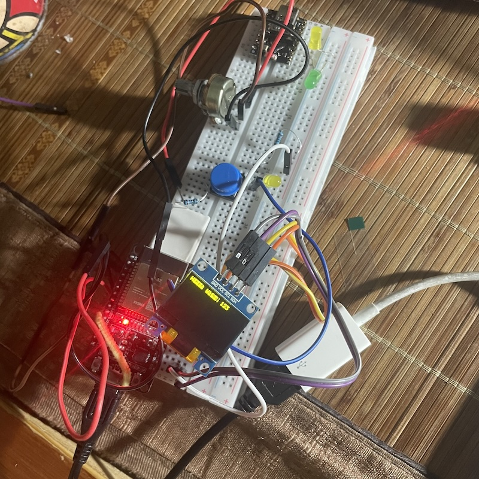

# ESP32 + SSD1306 demo via platformio / esp-idf

raw initial i2c mode to drive SSD1306 display

这是一个 google gemini 帮助下, 从零开始调试写出的 SSD1306 显示英文字符的一个演示
所有代码均有 google gemini 在我引导与调试中, 一步一步修改, 最后完成显示测试

请不要使用本项目于生产中!!
请不要使用本项目于生产中!!
请不要使用本项目于生产中!!

